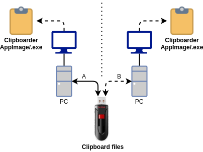

# Clipboarder

## Introduction

This desktop application exchanges clipboards between computers via removable  storage.
This is useful when there is no direct network connection possible between computers.

The following clipboard types can be loaded/saved:

* Plain/text
* HTML
* RTF
* PNG picture

It is recommended to use a KVM switch with USB support to exchange the clipboard via a USB memory stick between two or more computers, for example in the picture below:



Note: This is a clipboard copier and cannot exchange binaries or files.

### Screenshot Clipboarder on Ubuntu


## Prerequisites

* Windows or Linux (Raspberry Pi planned)
* No administrator and no root access needed.
* No internet connection required.
* No automatic updates.
* Exchange clipboard between computers via:
  * USB memory stick, or
  * Online storage such as Nextcloud

## Installation

Download latest version from the [releases page](https://github.com/Erriez/Clipboarder/releases).

### Windows

* Run the setup `clipboarder Setup x.x.x.exe` to start installation.
* Desktop and Start menu icons are created automatically.
* An uninstaller is available via `Settings | Apps | Clipboarder <version> | Uninstall`.
* Application is installed in `%LocalAppData%\Programs\clipboarder\`.

### Linux

* No installation is required.  

Set execute permission on the file AppImage:

```bash
$ chmod +x clipboarder-x.x.x.AppImage
```

Double click on the AppImage to start, or start from the commandline:

```bash
$ ./clipboarder-x.x.x.AppImage
```

### Set clipboard directory

Set clipboard directory of the USB stick or cloudstorage. This is asked at first launch and can be changed later via the system tray icon `Clipboard Files | Clipboard path`.

### Save/load clipboard

Three system tray clipboard colors indicates clipboard status:

Clipboard directory not found, for example USB stick unmounted:


Clipboard changed and not saved:


Clipboard saved:


### Automatic startup

Enable or disable automatic startup: `Settings | Launch at startup`.
The `AppImage` or `.exe` should not be moved.

* Windows: `HKEY_CURRENT_USER\SOFTWARE\Microsoft\Windows\CurrentVersion\Run\ | clipboarder <version>`
* Linux: `~/.config/autostart/clipboarder-<version>.AppImage.desktop`

### Remove clipboard files after load

Enable or disable removing clipboard files after load: `Settings | Remove clipboard files after load`.

### Clipboard conversions

Several clipboard conversions are available:

* Lower case
* Upper case
* Linux endlines (LF \n)
* Windows endlines (CR/LF \r\n)
* To plain text (remove formatting)

Note: Conversions are applied directly in the clipboard as text and are not automatically saved.

### Configuration file

User settings are saved in:

* Windows: `%AppData%\clipboarder\user-preferences.json`
* Linux: `~/.config/clipboarder/user-preferences.json`

### Unmounting

Safely unmounting the USB stick is a user responsibility. Unmounting from a menu is planned.

## Build from source

Building from source requires an internet connection. Open command prompt and run the commands:

### NodeJS installation Windows

Download and install [NodeJS for Windows](https://nodejs.org/en/download/).

### NodeJS installation Ubuntu

Node/NPM packages are outdated when installating via `apt`. Install latest version via NVM instead:

```bash
# Install NodeJS via NVM installer
$ curl https://raw.githubusercontent.com/creationix/nvm/master/install.sh | bash 
$ source ~/.profile   
$ nvm install node 

# Check installation
$ node --version
$ npm -v
```

### Build Windows and Linux

```bash
# Clone repository
$ git clone https://github.com/Erriez/Clipboarder.git
$ cd Clipboarder

# Install NPM packages
$ npm install

# Run
$ npm run start

# Create release on Windows (NSIS installer) or Linux (AppImage)
$ npm run release
```

## Debugging

Open the clipboarder directory with the free [Visual Studio Code](https://code.visualstudio.com/).  
To start debugging, run the `start` script.

## Technical details

The application is build around the popular NodeJS [Electron Boilerplate](https://github.com/szwacz/electron-boilerplate).
Reason is easy development, maintenance and deployment.

NPM dependencies:

* [auto-launch](https://www.npmjs.com/package/auto-launch)
* [clipboard-event](https://www.npmjs.com/package/clipboard-event)
* [electron](https://www.electronjs.org/)
* [electron-builder](https://www.electron.build/)

Clipboard documentation

* [Electron clipboard API](https://www.electronjs.org/docs/api/clipboard)

## FAQ

---

Q: Can I transfer the clipboard between Windows and Linux?

A: Yes, Windows - Windows, Linux - Linux and Windows - Linux is supported.

---

Q: I built from source and did not detect clipboard changes on Linux. Any hints?

A: Check execute permission on `node_modules/clipboard-event/platform/clipboard-event-handler-linux`
which may be missing after NPM install.

---

Q: Is MAC supported?

A: No.

Sorry Apple users, you're using a platform which is not compatible with Windows or Linux.

Without Apple hardware it is impossible for developers to build and test applications.
I'm happy to add MAC support when someone wants to sponsor me by providing a MAC Book Pro.

---

Q: My clipboard is not loaded in original format

A: This Clipboarder supports TXT/RTF/HTML/PNG only. Some applications use a propriatary clipboard format which is not saved/loaded.
Try `Clipboard Files | Show clipboard info` to identify the formats before the save and after the load to clipboard.

---

## MIT License

In simple words:

* Open source.
* Do what ever you want with the application.
* For personal and commercial usage.
* No warranties.
* Merge requests are welcome.

## Issues / bugs

Please report [issues here](https://github.com/Erriez/Clipboarder/issues).

## Donations

A [small donation](https://www.paypal.com/donate/?cmd=_s-xclick&hosted_button_id=FUPLMV8JNMJTQ) is appreciated, for example to implement MAC support.
