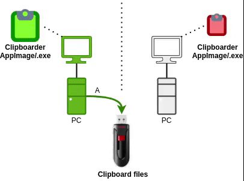
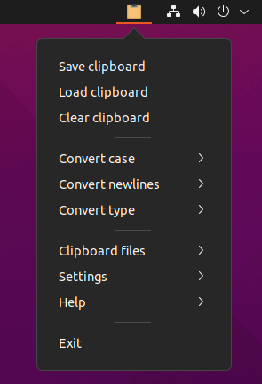
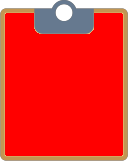

# Clipboarder

## Introduction

This desktop application exchanges clipboards between computers via removable  storage.
This is useful when there is no direct network connection possible between computers.

It is recommended to use a KVM switch with USB support to exchange the clipboard via a USB memory stick between two or more computers, for example in the picture below:



## Clipboarder Features

* Double click to install on Windows and run on Linux / Raspberry Pi (armv7l/amd64).
* Load/save clipboard types:
  * Plain/text
  * HTML
  * RTF
  * PNG image
* Clear clipboard
* Clipboard conversions:
  * Case
  * Newlines
  * To plain text
* Optional: Automitically load clipboard on USB mount.
* Optional: Remove clipboard files after loading clipboard files.
* Optional: Automatic launch at startup.

Note: This is a clipboard copier and cannot exchange binaries or files.

### Screenshot Clipboarder on Ubuntu



## Prerequisites

* Windows / Linux / Raspberry Pi Raspbian.
* No administrator and no root access needed.
* No internet connection required.
* No automatic updates.
* Exchange clipboard between computers via:
  * USB memory stick, or
  * Online storage such as Nextcloud

## Installation

Download latest version from the [releases page](https://github.com/Erriez/Clipboarder/releases).

### Windows

* Run the setup `clipboarder Setup x.x.x.exe` to start installation.
* Desktop and Start menu icons are created automatically.
* An uninstaller is available via `Settings | Apps | Clipboarder <version> | Uninstall`.
* Application is installed in `%LocalAppData%\Programs\clipboarder\`.

### Linux

* No installation is required.  

Set execute permission on the file AppImage:

```bash
$ chmod +x clipboarder-x.x.x.AppImage
```

Double click on the AppImage to start, or start from the commandline:

```bash
$ ./clipboarder-x.x.x.AppImage
```

### Set clipboard directory

Set clipboard directory of the USB stick or cloudstorage. This is asked at first launch and can be changed later via the system tray icon `Clipboard Files | Clipboard path`.

### Save/load clipboard

Three system tray clipboard colors indicates clipboard status:

Clipboard directory not found, for example USB stick unmounted:



Clipboard changed and not saved:


Clipboard saved:


Clipboard empty:


### Clear clipboard

Clears the clipboard and keeps clipboard files.

## Settings

### Automatic launch at startup

Enable or disable automatic startup: `Settings | Launch at startup`.
The `AppImage` or `.exe` should not be moved.

* Windows: `HKEY_CURRENT_USER\SOFTWARE\Microsoft\Windows\CurrentVersion\Run\ | clipboarder <version>`
* Linux: `~/.config/autostart/clipboarder-<version>.AppImage.desktop`

### Load clipboard files on mount

Enable or disable automatic clipboard load when clipboard directory mounted: `Settings | Load clipboard files on mount`.

### Remove clipboard files after load

Enable or disable removing clipboard files after load: `Settings | Remove clipboard files after load`.

### Clipboard conversions

Several clipboard conversions are available:

* Lower case
* Upper case
* Linux endlines (LF \n)
* Windows endlines (CR/LF \r\n)
* To plain text (remove formatting)

Note: Conversions are applied directly in the clipboard as text and are not automatically saved.

### Configuration file

User settings are saved in:

* Windows: `%AppData%\clipboarder\user-preferences.json`
* Linux: `~/.config/clipboarder/user-preferences.json`

### Unmounting

Safely unmounting the USB stick is a user responsibility. Unmounting via a menu is supported on Linux only.

## Build from source

See [BUILD.md](BUILD.md)

## FAQ

---

Q: Can I transfer the clipboard between Windows and Linux?

A: Yes, Windows - Windows, Linux - Linux and Windows - Linux is supported.

---

Q: Is MAC supported?

A: No.

Sorry Apple users, you're using a platform which is not compatible with Windows or Linux.

Without Apple hardware it is impossible for developers to build and test applications.
I'm happy to add MAC support when someone wants to sponsor me by providing a MAC Book Pro.

---

Q: My clipboard is not loaded in original format

A: This Clipboarder supports TXT/RTF/HTML/PNG only. Some applications use a propriatary clipboard format which is not saved/loaded.
Try `Clipboard Files | Show clipboard info` to identify the formats before the save and after the load to clipboard.

---

## MIT License

In simple words:

* Open source.
* Do what ever you want with the application.
* For personal and commercial usage.
* No warranties.
* Merge requests are welcome.

## Issues / bugs

Please report [issues here](https://github.com/Erriez/Clipboarder/issues).

## Donations

A [small donation](https://www.paypal.com/donate/?cmd=_s-xclick&hosted_button_id=FUPLMV8JNMJTQ) is appreciated, for example to implement MAC support.
